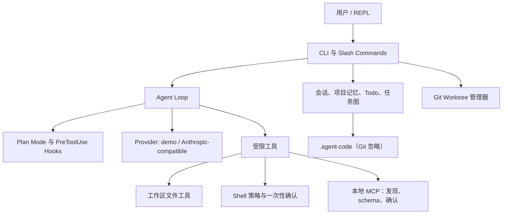

# 架构说明

`agent-code` 把模型决策、工具执行和用户授权分开。模型可以提出工具调用，但不能自行
改变权限策略或跳过确认。

## 关键数据边界

| 数据 | 保存位置 | 不保存的内容 |
| --- | --- | --- |
| 会话 | `.agent-code/sessions/*.jsonl` | 完整工具输出、明文凭据 |
| 项目记忆 | `.agent-code/project-memory.json` | 未经显式命令添加的偏好 |
| Todo / 任务图 | `.agent-code/` | 子代理完整私有上下文 |
| 编辑/命令审计 | 当前 REPL 进程 | 跨进程的无限审计日志 |
| MCP schema / 输出 | 当前 MCP 会话 | 持久化的完整远端 schema/输出 |

## 工具调用流程

1. Provider 提出工具调用。
2. Agent 先运行 Plan Mode 和 PreToolUse Hooks；拒绝后不会执行工具。
3. 工具自身再次执行工作区、参数、命令策略与 schema 校验。
4. 需要副作用的文件或 Shell 操作只创建待确认记录。
5. 用户输入对应一次性确认 ID 后，程序再次检查并执行；审计只记录最小摘要。
6. 工具结果被截断后再回填模型，防止工具输出无限占用上下文。

## 有意不做的事

本项目没有把 Agent 做成“拥有终端权限的自动化脚本”。不提供无限循环、自动 push、
静默合并、自动执行 MCP、OAuth 连接器或并发写任务。每一项都需要独立的身份、审计、
预算与恢复设计，超出本学习项目的安全范围。
